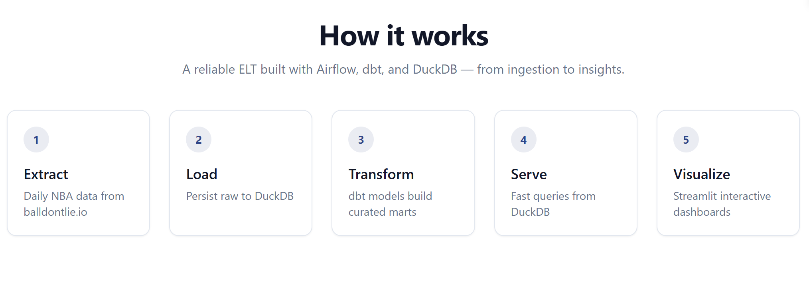

# Sports Analytics Pipeline

A production-ready ELT pipeline for NBA analytics using Airflow, dbt, and DuckDB. This pipeline ingests FiveThirtyEight NBA data, transforms it into analytics-ready data marts, and provides interactive visualizations through a Streamlit dashboard.

## Screenshots

### NBA Analytics Landing Page


### Data Pipeline Flow


## Overview

This pipeline demonstrates modern data engineering best practices:
- **Orchestration**: Apache Airflow schedules and monitors the entire pipeline
- **Transformation**: dbt handles SQL-based transformations with testing and documentation
- **Storage**: DuckDB provides a lightweight, performant analytical database (with options for Postgres/Snowflake/BigQuery)
- **Visualization**: Streamlit creates an interactive dashboard for exploring metrics

## Architecture


## Data Sources

The pipeline uses the **[balldontlie.io API](https://www.balldontlie.io/)** - a free, open NBA API that provides:

- **Live Game Data**: Updated daily with current season games
- **Team Information**: All 30 NBA teams with conference and division data
- **Player Statistics**: Season averages for all active players
- **No Authentication Required**: Free tier with generous rate limits

This modern API provides:
- Real-time game scores and results
- Team rosters and statistics
- Player performance metrics
- Historical game data

The API is configured in `.env` with:
- `NBA_API_BASE_URL`: The API endpoint (default: https://www.balldontlie.io/api/v1)
- `DAYS_TO_FETCH`: Number of days of historical games to fetch (default: 30)

**Note**: The pipeline previously used FiveThirtyEight data, which is no longer maintained. The new API provides more current and comprehensive data.

## Tech Stack

- **Apache Airflow 2.9**: Workflow orchestration and scheduling
- **dbt Core 1.7**: Data transformation and testing
- **DuckDB**: Default analytical database (in-process, no server required)
- **Python 3.9+**: Data fetching and processing scripts
- **Streamlit**: Interactive dashboards and visualizations
- **Docker**: Containerized Airflow deployment

## Project Structure

```
.
├── airflow/                    # Airflow configuration
│   ├── dags/                  # DAG definitions
│   │   └── sports_pipeline_dag.py
│   └── requirements.txt       # Airflow-specific dependencies
├── dbt/                       # dbt project
│   ├── models/               # SQL transformations
│   │   ├── staging/          # Raw data cleaning
│   │   └── marts/            # Business logic
│   ├── seeds/                # Reference data
│   └── tests/                # Data quality tests
├── scripts/                   # Python ETL scripts
│   ├── fetch_nba_api.py      # Fetch data from balldontlie.io API
│   ├── load_nba_api_data.py  # Load data into warehouse
│   └── export_metrics.py     # Export results for BI tools
├── app/                      # Streamlit application
│   └── streamlit_app.py      # Interactive dashboard
├── data/                     # Data storage
│   ├── raw/                  # API response data (CSV format)
│   ├── warehouse/            # DuckDB database
│   └── exports/              # CSV exports for BI
└── tests/                    # Unit tests
```

## Quickstart

### Prerequisites

- Python 3.9 or higher
- Docker and Docker Compose
- 4GB+ RAM available for Docker

### Installation

1. **Clone the repository**
   ```bash
   git clone <repository-url>
   cd sports-analytics-pipeline
   ```

2. **Set up environment**
   ```bash
   cp .env.example .env
   make install
   ```

3. **Initialize and start Airflow**
   ```bash
   make airflow-init
   make airflow-up
   ```

4. **Access Airflow UI**
   - Open http://localhost:8080
   - Login with username: `airflow`, password: `airflow`
   - Enable and trigger the `sports_pipeline_dag`

5. **Launch Streamlit dashboard**
   ```bash
   streamlit run app/streamlit_app.py --server.port ${APP_PORT:-8501}
   ```

### Running Without Airflow

For local development or testing:

```bash
make run-pipeline  # Runs all pipeline steps locally
make app          # Launch Streamlit dashboard
```

## Pipeline Components

### 1. Data Ingestion (`scripts/fetch_nba_api.py`)
- Fetches live NBA data from balldontlie.io API
- Retrieves teams, games (last 30 days), and player statistics
- Handles API pagination and rate limiting
- Saves data as timestamped CSV files with stable symlinks

### 2. Data Loading (`scripts/load_nba_api_data.py`)
- Creates database schemas (`raw`, `staging`)
- Loads API data into structured tables (teams, games, player_stats)
- Creates backward-compatible tables for existing dbt models
- Performs data quality checks and validation

### 3. dbt Transformations
- **Staging Layer**: Cleans and standardizes raw data
  - `stg_games`: Game-level data with calculated metrics
  - `stg_teams`: Team dimension with historical tracking
- **Marts Layer**: Business-ready analytics tables
  - `dim_teams`: Team attributes and performance metrics
  - `fct_games`: Detailed game facts with ELO changes
- **Metrics**: Pre-calculated KPIs
  - Win rates by team and season
  - Average point differentials
  - ELO rating changes

### 4. Data Quality Tests
- Column-level tests (not null, unique, relationships)
- Business rule validation (one winner per game, ELO sum checks)
- Row count thresholds

### 5. Metrics Export (`scripts/export_metrics.py`)
- Generates CSV files for BI tool consumption:
  - `team_win_rates.csv`: Season win percentages
  - `elo_trends.csv`: Rating changes over time
  - `point_diff_by_season.csv`: Scoring statistics

### 6. Streamlit Dashboard
Interactive visualizations including:
- Team win rates by season (bar/line charts)
- ELO rating trends (time series)
- Point differential analysis (box plots)
- Home court advantage metrics

## Configuration

### Environment Variables

Key settings in `.env`:

```bash
# Data source URLs (can be overridden)
NBA_ELO_URL=https://raw.githubusercontent.com/fivethirtyeight/data/master/nba-elo/elo.csv
NBA_ALLELO_URL=https://raw.githubusercontent.com/fivethirtyeight/data/master/nba-elo/nbaallelo.csv

# Warehouse configuration
WAREHOUSE=DUCKDB  # Options: DUCKDB, POSTGRES, SNOWFLAKE, BIGQUERY
DUCKDB_PATH=./data/warehouse/sports.duckdb

# Schedule (cron expression)
SCHEDULE_CRON=0 3 * * *  # Daily at 3 AM
```

### Switching Warehouses

**Default**: The pipeline uses DuckDB by default - no server required, runs locally.

**To use PostgreSQL**:

1. Update `.env`:
   ```bash
   WAREHOUSE=POSTGRES
   PG_HOST=localhost
   PG_PORT=5432
   PG_DB=sports
   PG_USER=postgres
   PG_PASSWORD=yourpassword
   ```

2. Install dbt adapter:
   ```bash
   pip install dbt-postgres
   ```

3. Update `dbt/profiles.yml` target from `dev` to `postgres`

4. Update `scripts/load_duckdb.py` to implement PostgreSQL loading (currently only DuckDB is implemented)

**Note**: Snowflake and BigQuery configurations are included in `profiles_template.yml` but require additional implementation in the loading scripts. The pipeline is production-ready with DuckDB and can be extended for other warehouses.

## Common Commands

```bash
make help              # Show all available commands
make install           # Install dependencies
make airflow-up        # Start Airflow services
make airflow-down      # Stop Airflow services
make dbt-seed-run      # Run dbt transformations
make exports           # Generate CSV exports
make app               # Launch Streamlit app
make test              # Run all tests
make clean             # Clean generated files
```

## Troubleshooting

### Issue: Data source URLs have changed

**Solution**: Update the URLs in your `.env` file:
```bash
NBA_ELO_URL=<new-url>
NBA_ALLELO_URL=<new-url>
```

### Issue: CSV headers don't match expected columns

**Solution**: The pipeline logs warnings for missing columns but continues processing. Check `scripts/fetch_538.py` for the expected column mappings and update if needed.

### Issue: dbt models fail to compile

**Solution**: 
1. Ensure DuckDB is installed: `pip install duckdb dbt-duckdb`
2. Check that `dbt/profiles.yml` exists (copy from `profiles_template.yml`)
3. Verify the warehouse path in `.env` is accessible

### Issue: Airflow webserver won't start

**Solution**:
1. Check Docker is running: `docker ps`
2. Ensure port 8080 is free: `lsof -i :8080`
3. Check logs: `make docker-logs`
4. Reset and reinitialize: `make airflow-down && make airflow-init`

### Issue: Streamlit can't connect to database

**Solution**:
1. Ensure the pipeline has run at least once
2. Check DuckDB file exists: `ls data/warehouse/sports.duckdb`
3. Verify `.env` file is in the project root

## Development

### Running Tests

```bash
# Run all tests
make test

# Run specific test file
pytest tests/test_fetch_538.py -v

# Run with coverage
pytest --cov=scripts tests/
```

### Adding New Data Sources

1. Create a new fetch script in `scripts/`
2. Add corresponding loader logic
3. Create dbt models in `dbt/models/staging/`
4. Update the Airflow DAG to include new tasks
5. Add tests for the new components

### Extending the Dashboard

The Streamlit app (`app/streamlit_app.py`) can be extended with:
- New chart types (heatmaps, scatter plots, etc.)
- Additional filters (date ranges, playoffs only)
- Real-time score updates
- Player-level analytics (if data is available)

## Performance Optimization

- **Incremental Loading**: Modify loaders to append new data rather than full refresh
- **Partitioning**: For larger datasets, partition by season or date
- **Materialization**: Change dbt models from `table` to `incremental` for large facts
- **Indexing**: Add indexes on commonly filtered columns (team_id, game_date)

## Production Deployment

For production use:

1. **Security**: 
   - Change default Airflow password
   - Use environment-specific `.env` files
   - Implement proper secret management

2. **Monitoring**:
   - Set up Airflow email alerts
   - Add data quality dashboards
   - Implement SLA monitoring

3. **Scaling**:
   - Use Kubernetes Executor for Airflow
   - Consider managed services (Astronomer, MWAA)
   - Implement data partitioning strategies

## Contributing

1. Fork the repository
2. Create a feature branch
3. Make your changes with tests
4. Ensure all tests pass (`make test`)
5. Submit a pull request

The CI pipeline will automatically validate your changes.

## License

This project is licensed under the MIT License - see the [LICENSE](LICENSE) file for details.

Copyright (c) 2025 Abdul Sohail Ahmed

## Acknowledgments

- Data provided by [balldontlie.io](https://www.balldontlie.io/) - Free NBA API
- Built with open-source tools: Airflow, dbt, DuckDB, Streamlit
